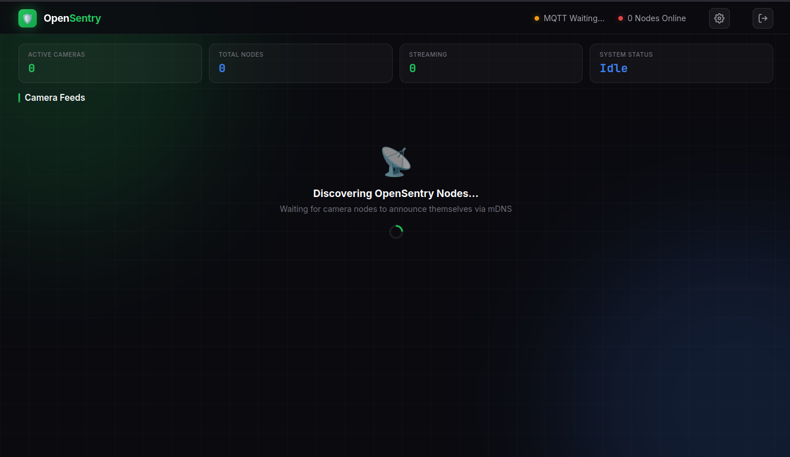
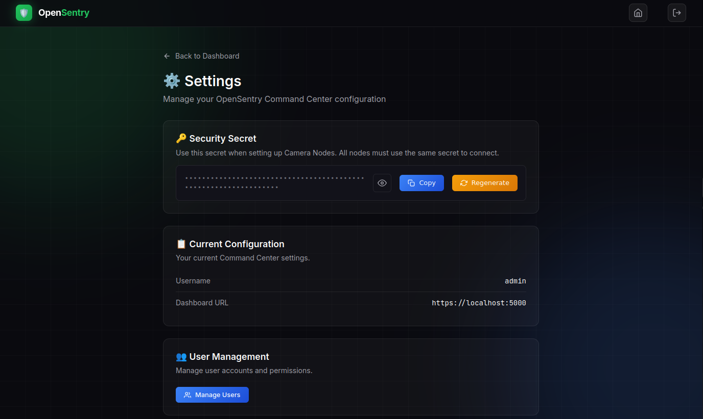
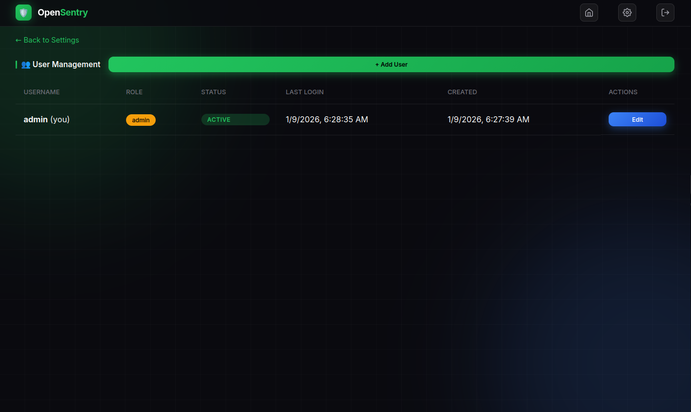
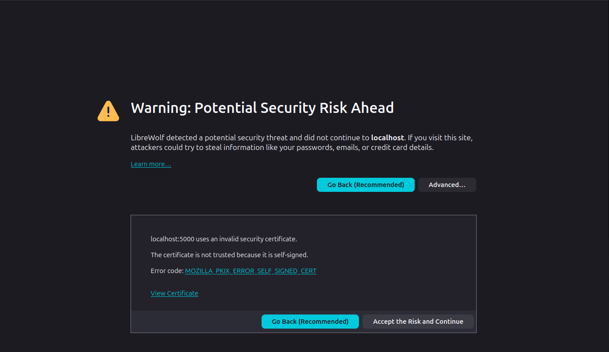

# 🛡️ OpenSentry Command Center

**View and control all your security cameras from one dashboard.**

**🔒 Fully Encrypted:** HTTPS web UI, RTSPS video streams, MQTT over TLS



---

## 🚀 Quick Start

### Step 1: Install Docker

**Linux:**
```bash
curl -fsSL https://get.docker.com | sh
sudo usermod -aG docker $USER
```
Then log out and back in.

**Mac:** [Download Docker Desktop](https://www.docker.com/products/docker-desktop)

**Windows:** See [Windows Setup (WSL)](#-windows-setup-wsl) below.

---

### Step 2: Download the Project

```bash
git clone https://github.com/SourceBox-LLC/OpenSentry-Command.git
cd OpenSentry-Command
```

---

### Step 3: Run Setup

```bash
chmod +x setup.sh && ./setup.sh
```

You'll see:
```
╔═══════════════════════════════════════════════════════════════╗
║         OpenSentry Command Center - Quick Setup               ║
╚═══════════════════════════════════════════════════════════════╝

✅ Docker found
```

---

### Step 4: Choose Username & Password

The setup will ask you to create login credentials:

```
📝 Let's configure your Command Center...

Choose a username [admin]: admin
Choose a password (min 8 chars): ********
```

---

### Step 5: Done!

The Command Center starts automatically:

```
🚀 Starting Command Center...

╔═══════════════════════════════════════════════════════════════╗
║                    Setup Complete!                            ║
╠═══════════════════════════════════════════════════════════════╣
║  Dashboard:  https://localhost:5000                           ║
║  Username:   admin                                            ║
║  Password:   ********                                         ║
╠═══════════════════════════════════════════════════════════════╣
║  Commands:                                                    ║
║    View logs:    docker compose logs -f                       ║
║    Stop:         docker compose down                          ║
║    Restart:      docker compose restart                       ║
╚═══════════════════════════════════════════════════════════════╝
```

**Open https://localhost:5000** and log in. 🎉

> **Note:** On first visit, your browser may show a certificate warning. This is normal for self-signed certificates. Click "Advanced" → "Proceed" to continue securely.

---

## 📷 Adding Cameras

1. Log into the Command Center dashboard
2. Click the **⚙️ Settings** icon (top right)
3. Copy your **Security Secret**
4. Set up [OpenSentry Camera Nodes](https://github.com/SourceBox-LLC/OpenSentry-Node) using this secret



### User Management

Admins can create and manage user accounts from **Settings → Manage Users**:
- **Admin** role: Full access to all features
- **Viewer** role: View-only access to camera streams



Cameras auto-discover within 30 seconds.

---

## 🎮 Dashboard Controls

| Button | Action |
|--------|--------|
| **▶ Start** | Start video stream |
| **⏸ Pause** | Pause stream |
| **⏻ Shutdown** | Turn off camera |

| Status | Meaning |
|--------|---------|
| 🟢 Streaming | Camera active |
| 🟡 Idle | Paused |
| 🔴 Offline | Not responding |

---

## 🔧 Common Commands

```bash
# View logs
docker compose logs -f

# Stop
docker compose down

# Restart
docker compose restart

# Update
git pull && docker compose up --build -d

# Complete teardown
chmod +x teardown.sh && ./teardown.sh
```

---

## 🌐 Remote Access (Tailscale)

Access your Command Center from anywhere using [Tailscale](https://tailscale.com) - a free, secure VPN.

### Setup

1. **Install Tailscale on your server:**
   ```bash
   curl -fsSL https://tailscale.com/install.sh | sh
   sudo tailscale up
   ```

2. **Install Tailscale on your phone/laptop:**
   - Download from [tailscale.com/download](https://tailscale.com/download)
   - Sign in with the same account

3. **Get your server's Tailscale IP:**
   ```bash
   tailscale ip -4
   # Example: 100.64.0.1
   ```

4. **Access from anywhere:**
   ```
   https://YOUR_TAILSCALE_IP:5000
   ```

### Why Tailscale?

| Benefit | Description |
|---------|-------------|
| **No port forwarding** | Works behind any firewall/NAT |
| **End-to-end encrypted** | WireGuard-based VPN |
| **Free for personal use** | Up to 100 devices |
| **No public IP exposure** | Your server stays hidden |

> **Note:** Your browser will still show a certificate warning since the cert is for `localhost`. Click through to proceed - the connection is still encrypted.

---

## ❓ Troubleshooting

| Problem | Solution |
|---------|----------|
| **No cameras showing** | Check both devices are on same WiFi. Wait 30 seconds. |
| **Can't log in** | Default: `admin` / `opensentry`. Check `.env` file. |
| **Account locked** | Wait 5 minutes. |
| **Port 5000 in use** | Stop other app or edit port in `docker-compose.yml` |

**Still stuck?** Run `docker compose logs -f` and check for errors.

---

## ⚙️ Configuration

Edit `.env` file (created by setup script):

```bash
# Login
OPENSENTRY_USERNAME=admin
OPENSENTRY_PASSWORD=your-password

# Security (must match camera nodes!)
OPENSENTRY_SECRET=your-secret-key

# Session timeout (minutes)
SESSION_TIMEOUT=30

# HTTPS (enabled by default)
HTTPS_ENABLED=true
```

After changes: `docker compose down && docker compose up -d`

---

## 🔒 Security Features

OpenSentry implements enterprise-grade security:

| Feature | Description |
|---------|-------------|
| **HTTPS** | Web UI encrypted with TLS on port 5000 |
| **RTSPS** | Video streams encrypted on port 8322 |
| **MQTT over TLS** | Control commands encrypted on port 8883 |
| **Authentication** | Multi-user with roles (admin/viewer) |
| **CSRF Protection** | Token-based protection on forms |
| **Security Headers** | CSP, X-Frame-Options, etc. |
| **Audit Logging** | All events stored in encrypted database |
| **Session Security** | Secure cookies, configurable timeout |
| **Media Storage** | Snapshots & recordings stored as encrypted DB blobs |

### Certificate Trust

The setup script offers to add the self-signed certificate to your system trust store:
- **Chrome/Chromium:** Uses system store (auto-trusted)
- **Firefox:** One-time "Accept the Risk" click required



*Firefox shows this warning on first visit - click "Advanced" → "Accept the Risk and Continue"*

### Network Ports

| Port | Protocol | Purpose |
|------|----------|---------|
| 5000 | HTTPS | Web dashboard |
| 8322 | RTSPS | Encrypted video from cameras |
| 8883 | MQTTS | Encrypted control commands |

### Data Storage

All data is stored in a single SQLite database (`data/opensentry.db`):

| Data | Storage |
|------|---------|
| **Users** | Database (hashed passwords) |
| **Cameras** | Database (metadata) |
| **Snapshots** | Database (binary blobs) |
| **Recordings** | Database (binary blobs) |
| **Audit Logs** | Database |

**No media files are exposed on the filesystem** - all snapshots and recordings are stored securely in the database.

---

## 🪟 Windows Setup (WSL)

Windows users can run OpenSentry using WSL (Windows Subsystem for Linux).

### Step 1: Install WSL

Open **PowerShell as Administrator** and run:

```powershell
wsl --install
```

Restart your computer when prompted.

### Step 2: Set Up Ubuntu

After restart, Ubuntu will open automatically. Create a username and password when asked.

### Step 3: Install Docker in WSL

In the Ubuntu terminal:

```bash
curl -fsSL https://get.docker.com | sh
sudo usermod -aG docker $USER
```

Close and reopen Ubuntu.

### Step 4: Follow Quick Start

Now follow **Steps 2-6** from the [Quick Start](#-quick-start) section above.

```bash
git clone https://github.com/SourceBox-LLC/OpenSentry-Command.git
cd OpenSentry-Command
chmod +x setup.sh && ./setup.sh
```

**Access the dashboard at https://localhost:5000** from your Windows browser.

---

## 🗑️ Uninstall

To completely remove OpenSentry Command Center:

```bash
chmod +x teardown.sh && ./teardown.sh
```

You'll be prompted to remove:
- Docker containers and images
- Configuration files (.env)
- Database (users, media, audit logs)
- SSL certificates

---

## 📜 License

MIT - Free for personal and commercial use.

---

**[OpenSentry Node](https://github.com/SourceBox-LLC/OpenSentry-Node)** · Made with ❤️ by the OpenSentry Team
